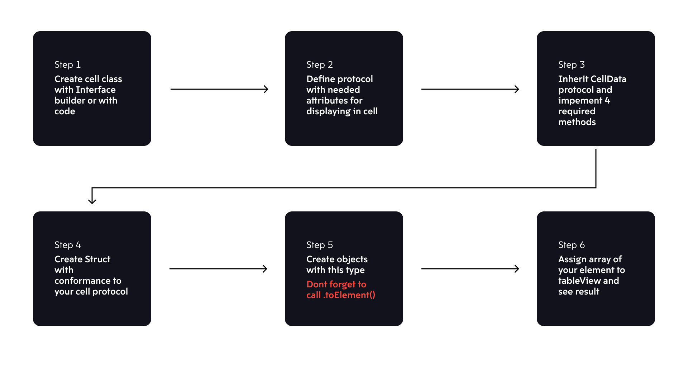

# CoreTableView


CoreTableView module for Data-Driven-UI Architecture. This lib is main UI Architecture pattern for Moscow Metro iOS Mobile App. Main advantages:
- 🤓  BEST UITableView Perfomance
- 💬  Very easy to integrate
- 📱  Working from iOS(11+) && guaranties same perfomance on iPhone 5s and 13 Pro Mapx
- 🚴  All updates are natively

Please do not forget that the [DifferenceKit](https://github.com/ra1028/DifferenceKit) library is integrated into our wrapper. We have fixed the version and are following the update very closely. In any case, you don't need to import DifferenceKit separately into your project.    
    
## Integration

### if as local package
```swift
    dependencies: [
        .package(path: "../CoreTableView")
    ],
```

### if as shared package
```swift
    dependencies: [
        .package(name: "CoreTableView", url: "https://github.com/MosMetro-official/CoreTableView.git", from: "0.0.1")
    ],
```

## Structure

The Package is a wrapper for BEST UITableView perfomance, that is includes DifferenceKit lib inside. Available for iOS 11+.

## Usage



### UItableViewCell class

First of all, you need to set UITableViewCell. You can make it by Xib or natively code, it does not really matter. But you schuld define protocol, that will inherit from ours' **CellData**. 

Your UITableViewCell file will be pretty the same, but you need to implement some usefull stuff. With CoreTableView your file will be looked by that:

```swift

protocol _MyCellData : CellData {
    var title : String { get set }
    var image : UIImage? { get set }
    var separator : Bool { get set }
}

extension _MyCellData {
    
    func prepare(cell: UITableViewCell, for tableView: UITableView, indexPath: IndexPath) {
        tableView.register(StandartImageCell.nib, forCellReuseIdentifier: StandartImageCell.identifire)
        guard 
        let cell = cell as? StandartImageCell 
        else { return }
        cell.configure(with: self)
    }
    
    func cell(for tableView: UITableView, indexPath: IndexPath) -> UITableViewCell {
        guard 
        let cell = tableView.dequeueReusableCell(withIdentifier: StandartImageCell.identifire, for: indexPath) as? StandartImageCell 
        else { return .init() }
        return cell
    }
}

```
This protocol "_YourNameCellData_" need to be emplimented to make your state strictly typed && predictable - so now it cannot be used in any way except for this protocol. Extension for this protocol just predicted the Cell integration to the tableView. Cell(for) - great method, so BaseTableView will see your cell (DO NOT FORGET TO IMPLEMENT "tableView.register").

Prepare func is called when the cell "_willDisplay_" so it's configure will be BEFORE it displayed.

From this protocol follows, that in _YourTableViewCell_ class schould implement **configure(with data: _YourCellData_)** method. So your class will look like this:

```swift
class MyCell : UITableViewCell {
        
    @IBOutlet weak private var title : UILabel!
    @IBOutlet weak private var image : UIImageView!
    @IBOutlet weak private var separator : UIView!
    
    public func configure(with data: _MyCellData) {
        self.title.text = data.title
        self.image.image = data.leftImage
        self.separator.isHidden = !data.separator
        self.leftImage.tintColor = imageColor
    }
}

```

### UIView / UIViewController classes

Here you need to set BaseTableView - main actor for the lib. You can host it in Xib / Storyboard file or natively by code.

```swift

    @IBOutlet weak private var tableView : BaseTableView!

    ======OR======

    private lazy var tableView : BaseTableView = {
        var tableView : BaseTableView!
        if #available(iOS 13.0, *) {
            tableView = BaseTableView(frame: .zero, style: .insetGrouped)
        } else {
            tableView = BaseTableView(frame: .zero, style: .grouped)
        }
        tableView.separatorColor = .clear
        tableView.showsVerticalScrollIndicator = false
        tableView.showsHorizontalScrollIndicator = false
        return tableView
    }()
```

Anyway, this tableView wrapper created for convenient table management in Data-Driven-UI Architecture. So this Arch is built on States, that you schould strictly type. So. your view will be setted like:

```swift

final class MyView : UIView {
    
    @IBOutlet weak private var tableView: BaseTableView!
    
    struct ViewState {
    
        struct Loading : _LoadingData {
            let title : String
            let descr : scting
        }
    
        struct Header : _HeaderData {
            let title : String
        }
    
        struct _MyCell : _MyCellData {
            let icon : UIImage?
            let title : String
            let onSelect : (() -> Void)
        }
    }
    
    public var viewState: ViewState = ViewState(state: []) {
        didSet {
            DispatchQueue.main.async {
                self.tableView.viewStateInput = self.viewState.state
            }
        }
    }
}
```

In this case you should STRICTLY describe all possible screen states with a table, accordingly, if the screen has several states (for example, working, error and loading), then at least 3 cells should be created in the table (actually, working, with error and with loading).

Updating your UI we offer from controller, that is preparing states for us. For example, making loading state:

```swift

final class MyController : UIViewController {

    let nestedView = MyView.loadFromNib()
    
    override func loadView() {
        self.view = self.nestedView
    }

    private func makeLoadingRow() -> Element {
        return MyView.ViewState.LoadingData(
            title : "Loading",
            descr : "Wait a bit..."
        ).toElement()
    }
    
    private func makeState() {
        let stateModel = SectionState()
        let blockModel = State(model: stateModel, elements: [
            self.makeLoadingRow()
        ])
        self.nestedView.viewState.state = [blockModel]
    }
}
```

If you want to add Header / Footer, it easy:

```swift

======SAME STUFF======

    private func makeHeader() {
        return MyView.ViewState.Header(
            title : "Header"
        )
    }

    private func makeState() {
        let stateModel = SectionState(header: self.makeHeader())
        let blockModel = State(model: stateModel, elements: [
            self.makeLoadingRow()
        ])
        self.nestedView.viewState.state = [blockModel]
    }
```

## Perfomance

If you want to get the BEST perfomance of the BaseTableView, you need to implement **hashValues() -> [Int]** and **calculateHeight() -> CGFloat** functions.

```swift

extension _MyCellData {
    
    func hashValues() -> [Int] {
        return [title.hashValue, image.hashValue, separator.hashValue]
    }
    
    static func calculateHeight(title: String, hasAccesory: Bool, margin: CGFloat) -> CGFloat {
        let leftMargin = 64.0
        let rightMargin = 16.0 + (hasAccesory ? ((UIScreen.main.bounds.width - 32) * 0.08) : 0)
        let topAndBottomMargin = 22.0
        
        let titleSize = title.height(withConstrainedWidth: finalWidth, font: .Body_17_Regular)
        let finalWidth = UIScreen.main.bounds.width - leftMargin - rightMargin - margin * 2
        return topAndBottomMargin + titleSize + 4 + subtitleSize + 8
    }
}
```

The implementation of these functions is necessary for a seamless and immediate update of the Base Table View. If the table knows the height of each cell in advance, then you can update the table without loss of performance.

The built-in Difference kit library compares the hash value of the table cell content and updates only those cells that need updating.

The most important part for the best perfomance using BaseTableView is to calculate YourTableViewCell height. You can do it by yourself, if your constraints are fixed - just calculate the height and return the value. But if you have some greaterOrEqual constraint, for a label - you can calculate it by using our extesion "_.height(withConstrainedWidth: CGFloat, font: UIFont)_"
